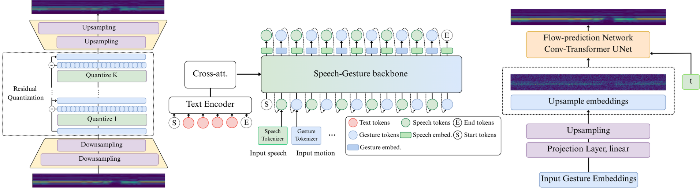

# GELINA: Unified Speech-Gesture Synthesis via Interleaved Token Prediction 🎙️🙌

**Téo Guichoux**, **Théodor Lemerle**, **Shivam Mehta**, **Jonas Beskow**, **Gustave Eje Henter**, **Laure Soulier**, **Catherine Pelachaud**, **Nicolas Obin**

> **Talk and move with one model.**  
> **GELINA** is a unified autoregressive model that generates **natural speech and synchronized 3D gestures** by interleaving tokens in a single stream.

[](https://anon24916-lgtm.github.io/)
[](https://arxiv.org/abs/2510.12834)

<div align="center">

**One model · One pass · Flexible input**  
**Cloning** · **Speech→Gesture** · **Joint speech-gesture generation**

</div>



---

### This is the official implementation of our paper available on [arXiv](https://arxiv.org/abs/2510.12834).


### 👉Check out our [demo videos](https://anon24916-lgtm.github.io/) !


## 1) Installation

```bash
conda create -n gelina python=3.11
```

```bash
conda activate gelina

cd Gelina

pip install -e .

# On GPU node (need cuda)
pip install -e .[gpu]   --extra-index-url https://download.pytorch.org/whl/cu118

pip install --editable ./external/causal-conv1d \
    --no-build-isolation --config-settings editable_mode=compat


pip install -e external/Matcha-TTS/
pip install -e external/WavTokenizer/
pip install -e packages/*
```

or simply run the ```ìnstall.sh``` file.

Download the model checkpoints and necessary files [here](https://drive.google.com/file/d/1JnfyYCH0TQ6JpQl1duL6XN4hlj07iYmd/view?usp=drive_link)

Unzip the file at the root dir of the project.

---

## 2) Inference (Quick Start)

To clone the segments of Speaker 2 (“Scott”):

```bash
conda activate gelina
python scripts/inference/clone_segments_cfm.py mode='cloning' # mode can be 'cloning', 'vanilla', 'speech2ges'
```

For basic inference:

```bash
python scripts/inference/vanilla_infere_cfm.py
```
Check the ```infer.yaml``` config for hyperparameters.

🥳 Gelina now support streaming inference ! 
We implemented chunk-based streaming inference to speed-up generation.

```bash
python scripts/inference/streaming_infere_cfm.py
```

Check the ```streaming_infer.yaml``` config for hyperparameters.

---

## 3) Data Preparation & Processing

Download BEAT2 following the instructions at:
[https://github.com/PantoMatrix/PantoMatrix/tree/6ca70b9541285b124da2eeedcd80f7c5a54eb111](https://github.com/PantoMatrix/PantoMatrix/tree/6ca70b9541285b124da2eeedcd80f7c5a54eb111)
Save the dataset in your `ROOT_DIR`.


### 3.1 Create and save a `DatasetDict`

```bash
python scripts/preprocessing/beat_hf.py root_dir=/path/to/ROOT/BEAT2/ save_path=/path/to/data/beat_hf
```

### 3.2 Run ASR on BEAT2

Create a lightweight environment:
```bash
conda create -n data-preprocess python=3.10
conda activate data-preprocess
pip install -r preprocess_requirements.txt
pip install -e packages/*

```
```bash
python scripts/preprocessing/asr.py save_path=/path/to/data/beat_hf save_path_2=/path/to/data/beat_transcribed_hf device='cuda'
```

You can change the Whisper model in `configs/preprocess/asr_dataset.yaml`. We use Turbo by default for efficiency.

### 3.3 Tokenize audio segments

```bash
python scripts/preprocessing/tokenize_audio.py save_path=/path/to/data/beat_transcribed_hf save_path_2=/path/to/data/beat_tokenized_hf
```

### 3.4 Tokenize dataset (motion)

Use the gelina env.
```bash
conda activate gelina

python scripts/preprocessing/tokenize_motion.py save_path=/path/to/data/beat_tokenized_hf save_path_2=/path/to/data/beat_motion_tokenized_hf
```

You can remove previously saved versions of the dataset (e.g., `beat_transcribed_hf`, `beat_tokenized_hf` and `beat_hf`) after this step.

### 3.5 Dataset of embeddings

c.f 4.4


---

## 4) Training

### 4.1 Train RVQVAE

```bash
python scripts/train/train_vq.py datamodule.num_workers=8 datamodule.root_dir=/path/to/data/
```

In the original paper, the **additional** split was not used for VAE training. To merge it into train, set `merge_train_additional: True` in:
`configs/vq/datamodule/beat_smpl.yaml`.

### 4.2 Pre-train Gelina

This will download and process large TTS datasets from HuggingFace (ensure enough storage).

```bash
python scripts/train/train_gelina.py +experiment=speech_pt_random-ltts_mls_ggsp-167M-freeze_motion +datamodule.save_dir=/path/to/root/dir/
```

### 4.3 Fine-tune Gelina

Processes the tokenized BEAT dataset (ensure sufficient storage).

```bash
python scripts/train/train_gelina.py +experiment=beat-pt_ltts_mls_ggsp_random_motion-167M-1qz-lr5e-5 +datamodule.save_dir=/path/to/root/dir/
```

### 4.4 Create latent dataset

```bash
python scripts/preprocessing/generate_latent_dataset.py root_dir=/path/to/root/ batch_size=1
```

### 4.5 Train CFM

```bash
python scripts/train/train_cfm.py +experiment=rec_loss
```

---

## 5) Evaluation

Compute FGD, BC, Diversit, WER, CER and Similarity. Note that the similarity metric is not the one we used in the paper. For that, refer to the script in ```sim_prompt.py``` .

```bash
python scripts/eval/evaluate_from_folder.py root_dir=/path/to/root/dir/with/BEAT2/ gt_folder=out/segments_speaker_2/gt_segments gen_folder=out/segments_speaker_2/cloning_2025-10-03_17-04-05
```

---


## 6) Misc / Version Pinning

If the flash-linear-attention repo changed, recover the exact commit used:

**Using FLA old commit**

```bash
cd external/flash_linear_attention
git checkout f247894e94acbd50e928d44fa43c13eec9cdfd4a --force 
```

Similarly for WavTokenizer:

**Using WavTokenizer old commit**

```bash
cd external/WavTokenizer
git checkout 02c66cbb4b05b3ee225419f00f3914eb1854b7d5 --force 
```

If CFM dataset creation fails during training (multiprocessing issues), you can run:

```bash
python packages/common/src/common/data/smpldataset.py
```

with the proper config; it will instantiate the Datamodule and save the dataset to disk.


<summary><strong>Cite us</strong> (BibTeX)</summary>

```bibtex
@misc{guichoux2025gelinaunifiedspeechgesture,
  title         = {GELINA: Unified Speech and Gesture Synthesis via Interleaved Token Prediction},
  author        = {T{\'e}o Guichoux and Th{\'e}odor Lemerle and Shivam Mehta and Jonas Beskow and Gustave Eje Henter and Laure Soulier and Catherine Pelachaud and Nicolas Obin},
  year          = {2025},
  eprint        = {2510.12834},
  archivePrefix = {arXiv},
  url           = {https://arxiv.org/abs/2510.12834}
}